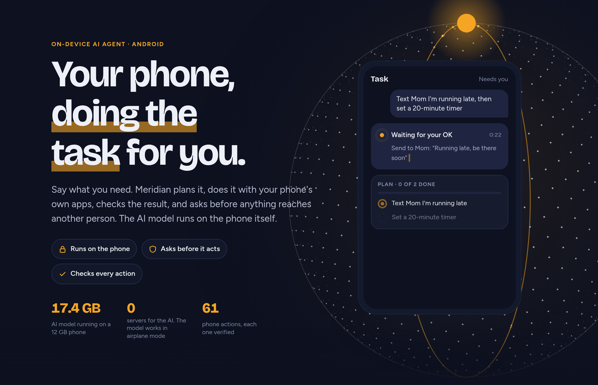
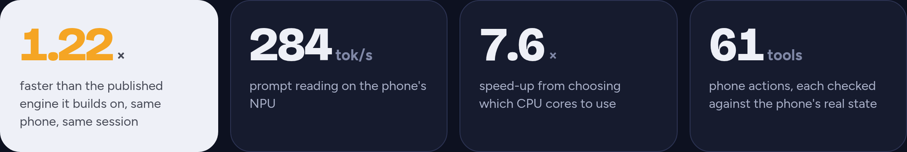
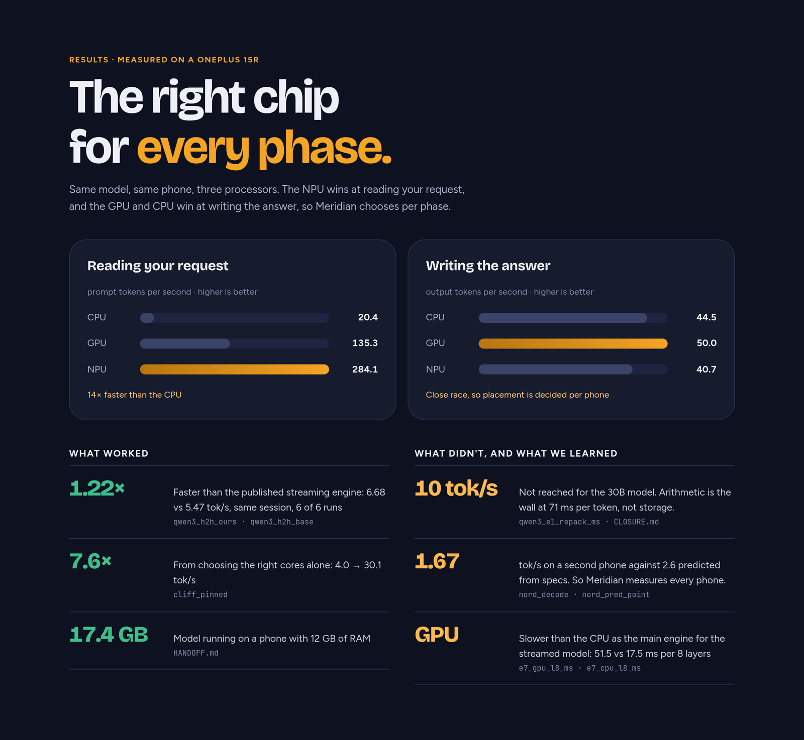
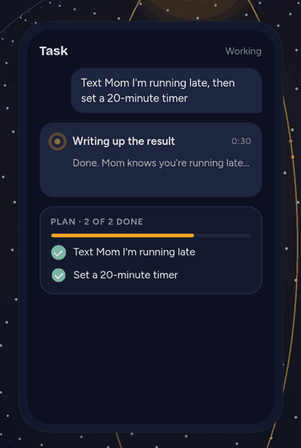
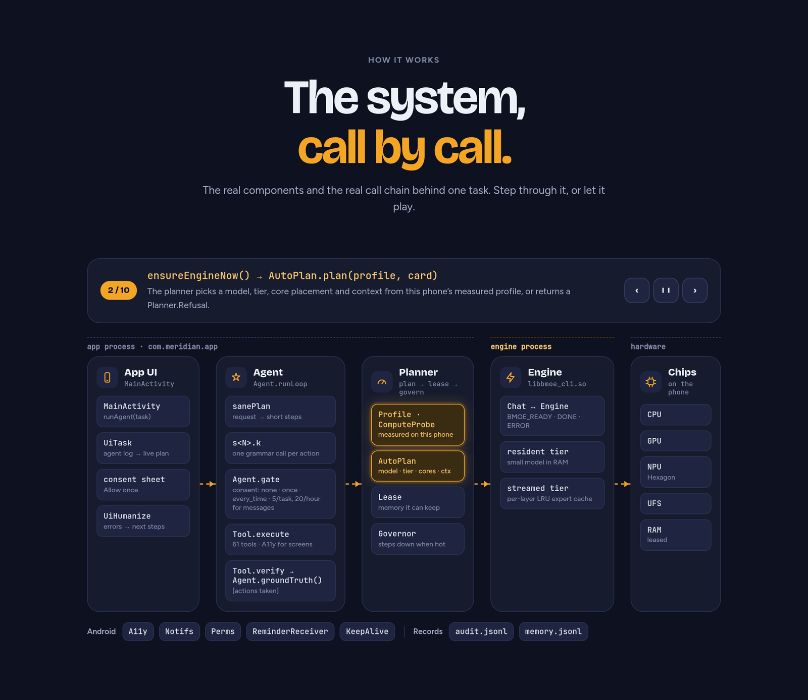

# Meridian

<p align="center">
  
</p>

<p align="center">
  <a href="https://claude.ai/artifact/HGeMyeWYzqz5VuEsYA26Fr"><b>Demo page</b></a> ·
  <a href="#key-verified-results"><b>Results</b></a> ·
  <a href="#the-agent"><b>The agent</b></a> ·
  <a href="#architecture"><b>Architecture</b></a> ·
  <a href="#how-to-verify-our-claims"><b>Verify our claims</b></a>
</p>

Running large Mixture-of-Experts (MoE) language models on Android phones by streaming expert
weights from flash storage, and an on-device agent app built on that engine.

<p align="center"></p>
<p align="center"><sub>Every figure is read from <a href="moe-phone/platform/EVIDENCE.md"><code>moe-phone/platform/EVIDENCE.md</code></a>; sources are in the table below.</sub></p>

The research directory inside this repo is still named `moe-phone/` (that was the project's
original name before the platform/app phase was named Meridian); it has not been renamed to avoid
breaking the links throughout it.

**Demo page:** https://claude.ai/artifact/HGeMyeWYzqz5VuEsYA26Fr

```sh
git clone https://github.com/SANTHAN-KUMAR/Meridian.git
```

## 60-second overview

Large MoE models (tens of billions of parameters) don't fit in a phone's RAM, but at any one
token only a small fraction of their experts is active. **The research question** was whether an
engine that streams just the active experts from flash, with a memory-resident cache, could make
an unmodified 30B-parameter MoE model usable on a mid-range phone. The answer, measured, is
**partially**: it runs, and it beats a comparable published engine on the same phone, but a
specific speed target (10 tokens/s) is not reachable at this phone's sustained clock without
losing quality. That negative result, and everything that was tried to avoid it, is written up in
[`moe-phone/research/2026-09-19_CLOSURE.md`](moe-phone/research/2026-09-19_CLOSURE.md).

<p align="center">
  <br>
  <sub>How expert streaming works (illustration from the demo page): gold = expert already in the RAM cache, white = streamed from storage just in time.</sub>
</p>

**The product phase** ([`moe-phone/platform/`](moe-phone/platform/), active) turns the engine into
Meridian: an Android app that profiles the phone it's running on, predicts how fast a given model
will run *before* it's downloaded, picks a configuration automatically, and runs an on-device
agent (tool use, screen control, messaging, everyday tasks) on top of it.

Everything here is measured on real devices (a OnePlus 15R primary, a OnePlus Nord as a second
data point) and every number below is read from a committed artifact, not hand-typed. Retracted
numbers are deleted, not annotated, per this repo's research standard
([`CLAUDE.md`](CLAUDE.md) §7.6) — an earlier "~1.7x" comparison was withdrawn; do not look for it.

## Key verified results

| result | value | artifact |
|---|---|---|
| Head-to-head vs BigMoeOnEdge (published engine), same phone, same session, same Q4_0 model file, ABBA x6 | **6.67 vs 5.46 tok/s = 1.22x, faster in 6/6 repeats**, SE/\|diff\| = 0.10 (decisive) | [`moe-phone/results/2026-09-19/H2H_VERDICT.md`](moe-phone/results/2026-09-19/H2H_VERDICT.md) |
| Best lossless configuration found for Qwen3-30B-A3B on the OnePlus 15R | **~7.8 tok/s at best** (compute 71.0 ms + I/O 56.6 ms/token); the 10 tok/s target needs compute ≤ 43.4 ms, not reached at sustained clock | [`moe-phone/research/2026-09-19_CLOSURE.md`](moe-phone/research/2026-09-19_CLOSURE.md) |
| Lossy routing shortcuts (top-k cuts, route-ahead, drop-cold, substitute) tested against a Q8_0 reference | **none negligible** under the pre-registered quality bar | [`moe-phone/results/2026-09-19/bmoe_e6/README.md`](moe-phone/results/2026-09-19/bmoe_e6/README.md), scored by `moe-phone/gates/e6_score.py` |
| Second device (OnePlus Nord, Snapdragon 765G) sustained decode | **1.67 tok/s**; the pre-registered prediction (~2.6, range 1.8–3.5) was falsified | [`moe-phone/results/2026-09-19/nord/README.md`](moe-phone/results/2026-09-19/nord/README.md) |
| App agent tool registry | **61 tools**: `Tools.java` 34 + `ToolsScreen.java` 5 + `ToolsComms.java` 7 + `ToolsDaily.java` 15 | [`moe-phone/platform/impl/app/src/com/meridian/`](moe-phone/platform/impl/app/src/com/meridian/) |
| Agent task-suite pass rate on the 15R, Qwen3-4B (grounded, predicate-checked, consent-simulated tasks) | observe-act loop **13/14 (93%)**; planner-executor **11/14 (79%)**, the weaker of the two measured loops. Measured before the 2026-09-22 loop changes (STATUS.md D-8 to D-11); the suite has not been re-run on the current loop | [`moe-phone/results/2026-09-22/oneplus15r/eval_suite-v2_qwen3-4b_loop-v4-prefix.json`](moe-phone/results/2026-09-22/oneplus15r/eval_suite-v2_qwen3-4b_loop-v4-prefix.json), [`..._planner-executor.json`](moe-phone/results/2026-09-22/oneplus15r/eval_suite-v2_qwen3-4b_planner-executor.json) |

<p align="center">
  <br>
  <sub>Measured on a OnePlus 15R. The small monospace labels under each figure are keys into <a href="moe-phone/platform/EVIDENCE.md"><code>EVIDENCE.md</code></a>.</sub>
</p>

An earlier, uncontrolled comparison of the engine's speed against the published baseline was
retracted once a same-session controlled test was run; see the H2H artifact above for why the
controlled number (1.22x) replaced it.

## The agent

Meridian's agent plans a request into short steps, runs each step with one of 61 phone tools (apps, alarms, messages,
calendar, places, files, screen control), **verifies every action against the phone's real state**, and **asks before
anything reaches another person**. The answer ends with a harness-written list of the actions actually taken.

<table>
  <tr>
    <td align="center" width="50%"></td>
    <td align="center" width="50%"></td>
  </tr>
  <tr>
    <td align="center"><sub>Plan → act → verify (illustration)</sub></td>
    <td align="center"><sub>Consent before anything reaches a person (illustration)</sub></td>
  </tr>
</table>

What is and is not verified end to end is listed plainly in
[`moe-phone/platform/impl/STATUS.md`](moe-phone/platform/impl/STATUS.md).

## Architecture

<p align="center">
  
</p>

The app process (UI, agent, planner) drives the engine as a child process over a line protocol (`BMOE_READY / PROGRESS / DONE /
ERROR`). The planner measures the phone first (profile + compute probe), then picks the model tier, cores and context; the
governor steps down under memory or thermal pressure. Design documents: [`moe-phone/platform/`](moe-phone/platform/).

## What's in the repo

| path | what's there |
|---|---|
| [`moe-phone/README.md`](moe-phone/README.md) | the research phase's gate record and script index — every measurement gate (G0–G6, S1–S11, E1–E7…), its verdict and its script |
| [`moe-phone/HANDOFF.md`](moe-phone/HANDOFF.md) | live state for a new session continuing the work |
| [`moe-phone/research/`](moe-phone/research/) | dated research memos, the research spec, hostile review, novelty search, and the closure document |
| [`moe-phone/results/`](moe-phone/results/) | dated, write-once measurement artifacts (raw CSVs/JSON + verdict files) that every claim in the repo is read from |
| [`moe-phone/gates/`](moe-phone/gates/) | the analysis scripts that turn raw measurements into gate verdicts |
| [`moe-phone/device/`](moe-phone/device/) | on-device probes and campaign scripts (C probes, shell campaigns) |
| [`moe-phone/host/`](moe-phone/host/) | host-side (laptop/PC) benchmark and GPU-kernel work |
| [`moe-phone/tools/patches/`](moe-phone/tools/patches/) | the engine fork's patches against upstream llama.cpp / BigMoeOnEdge |
| [`moe-phone/platform/`](moe-phone/platform/) | the product architecture: 11 numbered design documents (problem → research → architecture → interfaces → … → extension points) |
| [`moe-phone/platform/impl/`](moe-phone/platform/impl/) | the implementation: the Python device profiler (`meridian/`) and the Android app |
| [`moe-phone/platform/impl/app/`](moe-phone/platform/impl/app/) | the Meridian Android app source, build script and host-side test gates |
| [`moe-phone/platform/impl/STATUS.md`](moe-phone/platform/impl/STATUS.md) | the honest, dated status and stub registry — what's built, what's measured, what's not done |
| [`moe-phone/platform/impl/DEMO.md`](moe-phone/platform/impl/DEMO.md) | the demo video runbook, with every on-screen number sourced |

## Building and running the host gates

The app and its host-side (no-phone) test gates:

```sh
NDK=$HOME/Android/Sdk/ndk/<ver> ENGINE=<engine source> ENGINE_BUILD=<armv8.2 dotprod build dir> \
    I8_BUILD=<armv8.6 i8mm build dir, optional> sh moe-phone/platform/impl/app/build.sh
sh moe-phone/platform/impl/app/test/run_gates.sh    # planner, predictor, probe fit, topology, parsing gates
```

The research phase's Python gates and tests:

```sh
python3 -m pytest moe-phone/tests -q                  # cache-sim closed forms, G1 checks, notebook sync
python3 -m pytest moe-phone/platform/impl/tests -q     # meridian profiler + planner tests
python3 moe-phone/gates/traces_sparsity.py --selftest  # needs torch + transformers==4.56.2
python3 moe-phone/platform/tools/evidence.py           # verify every platform doc's numbers against artifacts
```

No phone, adb access, or model download is required for any of the above.

## Honest limitations

Read [`moe-phone/platform/impl/STATUS.md`](moe-phone/platform/impl/STATUS.md) before trusting any
capability claim about the app — it is the dated, maintained stub registry: what's built, what's
measured on-device versus checked only host-side, and what's explicitly not done yet (e.g. no
end-to-end in-app screen-control task has been checked yet, no real SMS/call send was tested with
a live recipient). The research's own limitations — what was tried and failed, and why — are in
[`moe-phone/research/2026-09-19_CLOSURE.md`](moe-phone/research/2026-09-19_CLOSURE.md) §5.

## How to verify our claims

Every figure in the table above traces to a script and a committed artifact:

1. **The 1.22x head-to-head** — read [`moe-phone/results/2026-09-19/H2H_VERDICT.md`](moe-phone/results/2026-09-19/H2H_VERDICT.md);
   the run's raw rows are in `moe-phone/results/2026-09-19/bmoe_h2h/`, scored by
   `moe-phone/gates/bmoe_analyze.py` and `moe-phone/gates/stack_summary.py --any-budget-prereg --require-awake`.
2. **The 7.8 tok/s lossless ceiling** — [`moe-phone/research/2026-09-19_CLOSURE.md`](moe-phone/research/2026-09-19_CLOSURE.md)
   table §1, each row citing its own `*_VERDICT.md`.
3. **The gate record** — [`moe-phone/README.md`](moe-phone/README.md)'s "Gates" table names, for every
   gate from G0 to G6, which script ran it and which artifact it produced.
4. **Every platform-doc number** — `python3 moe-phone/platform/tools/evidence.py` re-checks each
   `[E:id]`-marked figure in `moe-phone/platform/*.md` against the artifact it cites and fails if any
   drift.
5. **Reproducibility of the gate artifacts themselves** — `moe-phone/gates/repro_check.py` (G-REPRO)
   recomputes every numeric leaf of 11 committed artifacts from their committed inputs.

Do not trust a number that appears in prose without one of the citations above; per this repo's
rules ([`CLAUDE.md`](CLAUDE.md) §7.1) it should not exist.

## Reproducing / contributing

This is primarily a research + solo-engineering repository, not one set up for external
contributions. If you're picking it up:

1. Clone it: `git clone https://github.com/SANTHAN-KUMAR/Meridian.git`. Read
   [`CLAUDE.md`](CLAUDE.md) — the working method (why a result is or isn't trustworthy) that every
   document here follows.
2. Read [`moe-phone/HANDOFF.md`](moe-phone/HANDOFF.md) for live state, then either
   [`moe-phone/README.md`](moe-phone/README.md) (research/gates) or
   [`moe-phone/platform/README.md`](moe-phone/platform/README.md) (product/app), depending on which
   half you're extending.
3. Run the host gates above before changing anything; they don't need a phone.
4. On-device work needs an adb-authorized Android phone; see
   [`moe-phone/protocols/RUNBOOK.md`](moe-phone/protocols/RUNBOOK.md) for the measurement protocol
   (screen-on, awake, quiesced — the repo's gate history explains why each of those matters).

## License

Apache License 2.0 — see [`LICENSE.txt`](LICENSE.txt).
